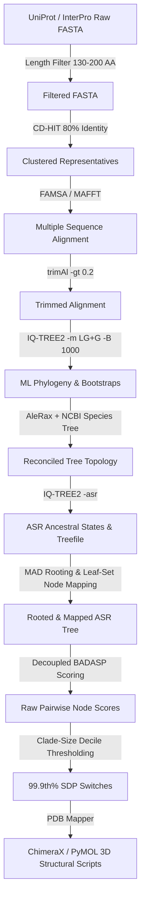

# BADASP Evolutionary Analysis Pipeline (IPR019888)

[](https://www.python.org/)
[](https://snakemake.readthedocs.io/)
[](https://opensource.org/licenses/MIT)

An advanced computational biology pipeline implementing the **BADASP** (Burst After Duplication with Ancestral Sequence Predictions) evolutionary analysis framework (Edwards & Shields, 2005) adapted with the analytical framework of Bradley & Beltrao (2019) and integrated with phylogenetic species reconciliation via AleRax (Morel et al., 2024). Applied to the **IPR019888** AsnC/Lrp-like transcriptional regulator family.

---

## Table of Contents
- [Overview](#overview)
- [Pipeline Architecture](#pipeline-architecture)
- [Installation & Environment](#installation--environment)
- [How to Run the Pipeline](#how-to-run-the-pipeline)
  - [Full Pipeline Execution](#full-pipeline-execution)
  - [Bypassing Heavy Computations (Fast Reproduction)](#bypassing-heavy-computations-fast-reproduction)
  - [Parallel Species Reconciliation Validation (`rec_check`)](#parallel-species-reconciliation-validation-rec_check)
- [HPC & Computing Environment Details](#hpc--computing-environment-details)
- [Key Features & Methodological Advances](#key-features--methodological-advances)
- [Repository Structure](#repository-structure)
- [Testing](#testing)

---

## Overview

The BADASP pipeline isolates **Specificity Determining Positions (SDPs)**—amino acid positions that have undergone functional divergence following duplication or speciation events—by comparing ancestral sequence predictions (ASR) across deep phylogenetic nodes.

### Key Objectives:
1. **Large-Scale Data Ingestion & Quality Control**: Fetch, clean, and cluster >110,000 sequences for InterPro family `IPR019888`.
2. **Species Reconciliation**: Reconstruct maximum-likelihood gene trees and reconcile them against NCBI species trees using **AleRax**.
3. **MAD Rooting & Node Mapping**: Perform **Minimal Ancestor Deviation (MAD)** tree rooting and transfer ASR node names using invariant leaf-set signature mapping.
4. **Decoupled Event BADASP Scoring**: Compute `Score = RC - (AC * p(AC))` for sister-clade pairs across Duplication, Speciation, and Transfer nodes.
5. **Adaptive Clade-Size Adjusted Thresholding**: Apply non-parametric percentile thresholds (95th, 97th, 99th, 99.9th) binned strictly by clade size deciles (calculated across all scores in one go per decile) to isolate true functional bursts from mutational drift, plotting switch events decoupled by event type.
6. **Structural Mapping**: Map identified SDP switches onto reference 3D PDB structures (e.g., `2CG4`) and generate ChimeraX/PyMOL visualization scripts (`.cxc`).

---

## Pipeline Architecture



---

## Installation & Environment

### Prerequisites
- Operating System: macOS or Linux
- Python: 3.9+
- Third-Party Bioinformatics Tools: `iqtree2`, `famsa`, `trimal`, `cd-hit`, `alerax`

### Setup Virtual Environment
```bash
# Clone the repository
git clone https://github.com/laflucETH/BADASP.git
cd BADASP

# Create and activate virtual environment
python3 -m venv venv
source venv/bin/activate

# Install dependencies
pip install -r requirements.txt
```

---

## How to Run the Pipeline

### Full Pipeline Execution
The pipeline is fully orchestrated using **Snakemake**.

```bash
# Run the full pipeline with Snakemake (adjust cores as available)
venv/bin/snakemake --cores 8
```

#### Key Pipeline Configurations (`config/snakemake.yaml`):
| Parameter | Default | Description |
| :--- | :--- | :--- |
| `cdhit_identity` | `0.8` | CD-HIT sequence clustering identity threshold |
| `trimal_gap_threshold` | `0.2` | Minimum column occupancy for trimAl trimming |
| `iqtree_model` | `LG+G` | Amino acid substitution model for IQ-TREE2 |
| `iqtree_bootstrap` | `1000` | Ultrafast bootstrap replicates (`-B 1000`) |
| `gene_tree_rooting_method` | `mad` | Rooting method (`mad` via `mad.py` or `midpoint`) |
| `badasp_min_occupancy` | `0.8` | Minimum alignment position occupancy for SDP scoring |

---

### Bypassing Heavy Computations (Fast Reproduction)

Because building the ML tree distribution and running AleRax species reconciliation on 21k sequences / 8.8k species are computationally intensive, pre-computed reconciliation files can be used to execute downstream MAD rooting, scoring, adaptive thresholding, and structural mapping locally in seconds.

```bash
# 1. Ensure pre-computed AleRax reconciliations are placed in results/reconciliation/alerax/IPR019888/
# 2. Touch Snakemake target checkpoints to skip heavy tree search/reconciliation steps:
venv/bin/snakemake --touch --cores 1

# 3. Run downstream MAD rooting, scoring, plotting, and structural mapping:
venv/bin/snakemake --cores 4
```

---

### Parallel Species Reconciliation Validation (`rec_check`)

To validate that species reconciliation ratios and event identifications are not biased by sequence density, a dedicated parallel pipeline (`Snakefile_rec_check`) is available. It performs a **Minimum Species Set Cover** to isolate a representative subset of species while maintaining 100% coverage of sequence clusters:

```bash
# Run the parallel species reconciliation validation pipeline
venv/bin/snakemake -s Snakefile_rec_check --configfile config/snakemake_rec_check.yaml --cores 4
```

---

## HPC & Computing Environment Details

Computational work is divided based on resource requirements and CPU performance:

1. **IQ-TREE 2 ML Tree Search & Bootstrap (Local Run)**:
   - **Environment**: Executed locally on Apple Silicon MacBook for superior single-thread and multi-core CPU execution.
   - **Command**: `iqtree2 -s data/interim/IPR019888_trimmed.aln -m LG+G -T AUTO --wbt -B 1000 --prefix data/interim/iqtree/IPR019888`
   - **Resources**: Run on **2 cores** (optimal thread count auto-detected by IQ-TREE).
   - **Runtime**: **256 hours 53 minutes 26 seconds** (~10.7 days).

2. **AleRax Species Reconciliation (ETH Euler HPC Run)**:
   - **Environment**: Submitted as a high-memory batch job on the ETH Euler HPC cluster due to heavy memory allocation required for full DTL reconciliation across 21k sequences / 8.8k species.
   - **Command**: `alerax -f data/interim/alerax/IPR019888.families.txt -s data/interim/alerax/IPR019888_species_tree.nwk -p results/reconciliation/alerax/IPR019888 --prune-species-tree`
   - **Resources**: **1 core** (AleRax single-family mode) with full memory allocation.
   - **Runtime**: **110 hours 48 minutes 27 seconds** (~4.6 days).

---

## Key Features & Methodological Advances

- **MAD Tree Rooting Integration (`scripts/root_and_map_tree.py`)**: Roots trees using Minimal Ancestor Deviation and transfers unrooted ASR node names (`Node53`, `Node52`, etc.) via leaf-set signature mapping (direct & complement matching), preventing node misalignment.
- **Clade-Size Adjusted Adaptive Thresholding**: Bins sister-clade comparisons into deciles strictly by minimum clade size. Calculates unified non-parametric percentile cutoffs (95th–99.9th) across all scores in each decile, then plots switch distributions decoupled by event type (Duplication, Speciation, Transfer).
- **Automated PDB Mapping (`src/badasp/pdb_mapper.py`)**: Aligns target sequence candidates against reference PDB models (e.g. `2CG4`) and outputs ChimeraX scripts (`.cxc`) highlighting top SDP switches in 3D.

---

## Repository Structure

```
BADASP/
├── Snakefile                               # Main Snakemake workflow definition
├── Snakefile_rec_check                     # Parallel species reconciliation validation workflow
├── config/
│   ├── snakemake.yaml                      # Primary pipeline configuration
│   └── snakemake_rec_check.yaml            # Validation pipeline configuration
├── src/
│   └── badasp/                             # Core Python package
│       ├── alerax_inputs.py                # AleRax family and mapping file generation
│       ├── scoring.py                      # Node-wise BADASP scoring algorithm
│       ├── plot_node_scores.py             # Score mapping & tree diagnostics visualization
│       ├── plot_tree_losses.py             # Branch loss count visualizations
│       ├── pdb_mapper.py                   # PDB structure alignment & ChimeraX script generator
│       └── tree_rooting.py                 # Canonical MAD / midpoint rooting wrapper
├── scripts/
│   ├── root_and_map_tree.py                # MAD tree rooting & leaf-set node mapping CLI
│   ├── compare_rootings.py                 # Fast O(N) side-by-side tree rooting comparator
│   ├── prepare_rec_check.py                # Sequence extraction for species set cover
│   ├── exploratory_set_cover.py            # Exact & greedy Minimum Species Set Cover solver
│   ├── plot_decoupled_event_switches_clade_adjusted.py  # Adaptive thresholding & switch plot generator
│   ├── plot_switches_vs_clade_size.py      # Switch count vs clade size decile analyzer
│   └── plot_switches_vs_root_distance.py   # Switch count vs root distance analyzer
├── tests/                                  # Pytest unit & integration test suite
└── PIPELINE_STATE.md                       # Comprehensive state management document
```

---

## Testing

All pipeline components follow strict Test-Driven Development (TDD).

To run the complete test suite:

```bash
PYTHONPATH=. venv/bin/pytest tests/
```

---

## References

1. **Edwards, R. J., & Shields, D. C.** (2005). BADASP: predicting specificity-determining residues using ancestral sequence prediction. *Bioinformatics*, 21(22), 4190-4191.
2. **Bradley, D., & Beltrao, P.** (2019). Evolution of protein interaction specificity through ancestral sequence reconstruction and reconciliation. *Nature Communications*, 10(1), 1-12.
3. **Morel, B., Williams, T. A., & Stamatakis, A.** (2024). AleRax: A tool for gene family species tree reconciliation and gene tree rooting. *Bioinformatics*, 40(4), btae162. https://doi.org/10.1093/bioinformatics/btae162
4. **Tria, F. D. K., Landan, G., & Dagan, T.** (2017). Phylogenetic rooting using minimal ancestor deviation. *Nature Ecology & Evolution*, 1(7), 0193.
